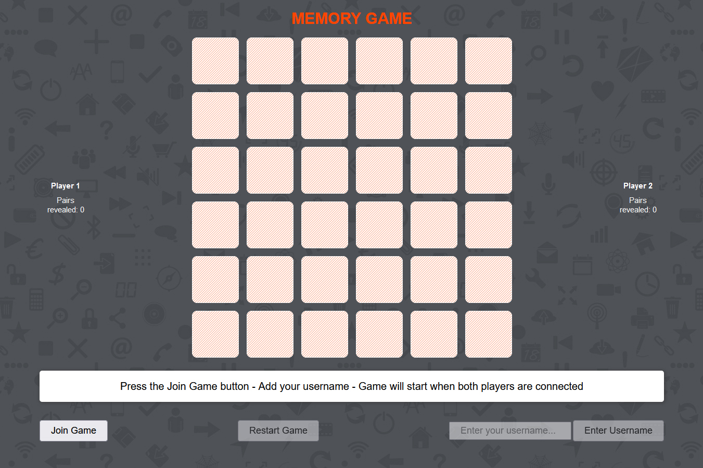
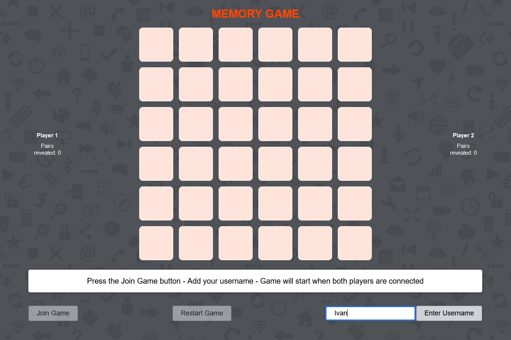
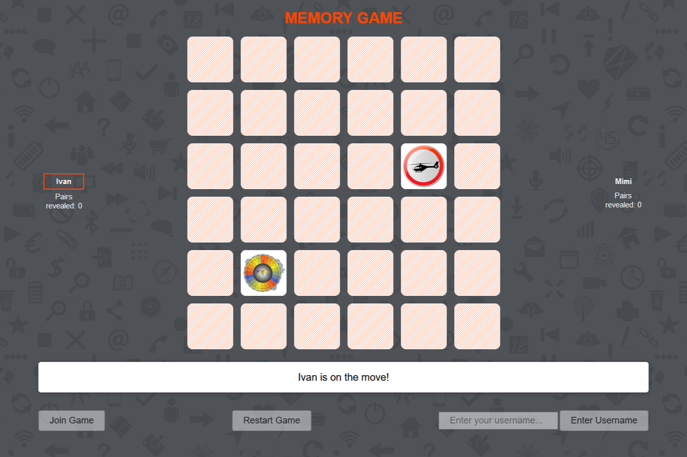
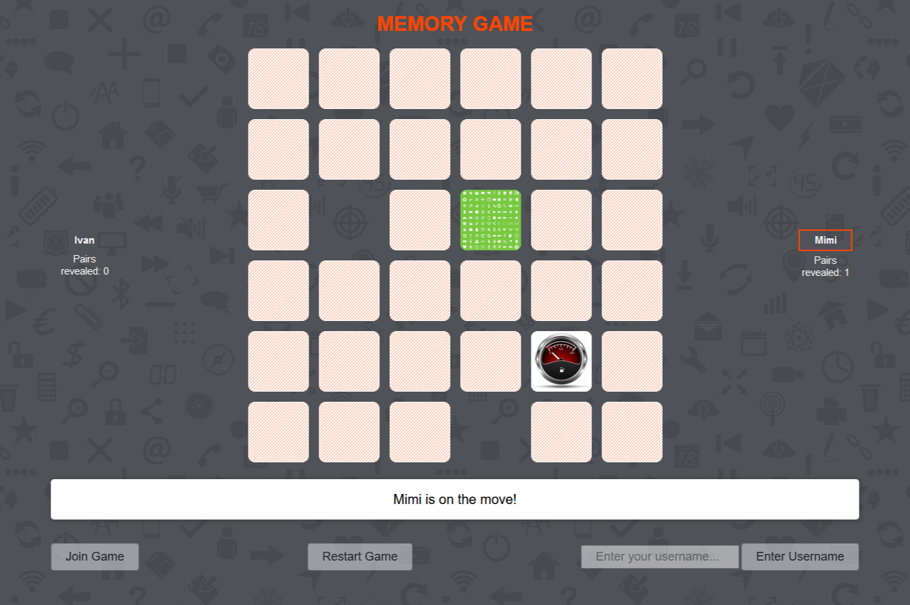

CREDITS - [IvanMPR](https://github.com/IvanMPR/Memory-multiplayer)

# Memory-multiplayer
<a href="https://multiplayer-memory-game.onrender.com" target="_blank">Live Demo</a>
 
 
Memory game for two players, 18 pairs total in game. All of the graphic files used in this game are my own creations. 
Players should follow the on screen instructions, after both players are connected, game will start. Player on turn reveals two cards, 
if he finds a pair, those cards are removed, and he has another try. If he misses the guess, other player is on turn. Game is over when
there are no more unreveald pairs left. Winner is declared, but the tie game is also possible, since there are even number of pairs on the board.
If the player clicks twice on the same opened card, he loses his current turn.

 
 

 
 

 
 

